

 

  
  <h3 align="center">London Transport Helper</h3>
  

    Travel efficiently within The Great Capital!
  

  
Table of Contents

  <ol>
    <li>
      <a href="#about-the-project">About The Project</a>
    </li>
    <li><a href="#features">Features</a></li>
    <li><a href="#roadmap">Roadmap</a></li>
    <li><a href="#building-and-starting-the-application">Building & Starting The Application</a></li>
    <li><a href="#license">License</a></li>
  </ol>

## About The Project

I've been a user of various apps that help with transit within London however every single one that I have tried have had some issues: intrusive ads, overly complex user interface or a shady privacy policy. With this application I envisioned a simple to use yet powerful and ethical application that helps you with your London travels. The application uses TFL's API to get all it's data and supports most of the major forms of transportation in London aparat from National Rail due to it's recent removal from the TFL's API. Please see the [Features](#features) section to see what the app can do!

(<a href="#top">back to the top</a>)

## Features

### Journey Planner

Journey planner is used to search for a route from destination A to B, simmilarly to how you would you Google Maps or other map software to help you find your way. You can enter your origin and destination points in the text fields on the journey planner view or you can use the location button to set the origin/destination to your current location:

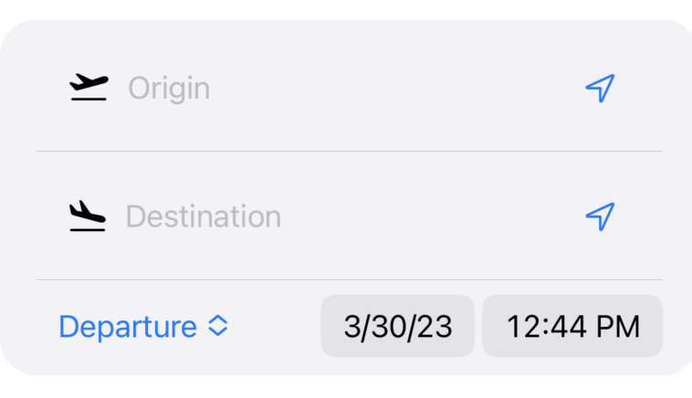

As you can see above you can also decide on what time you want to arrive at your destination or depart from your origin. After submitting you will be presented with a list of possible journeys that fit your timings as well as the predicted fare of the journey (sometimes not available).

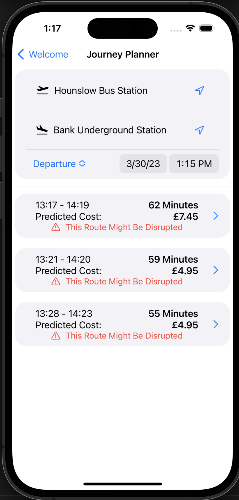

When you select a journey that fits your needs you will be transfered to a detailed explaination of the whole journey

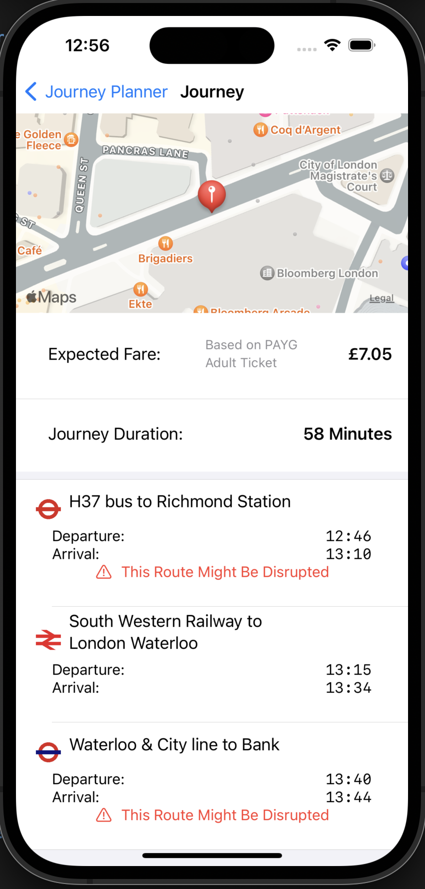

This detailed explaination will provide you with every step of journey that you need to take in order to arrive at your destination, it will tell you which mode of transportation to take and where to get off, you will also be provided with a warning in case the route is disrupted.

Sometimes the app cannot find the exact place that you have entered, in this case a list of locations that could match yours will be shown so that you can choose:

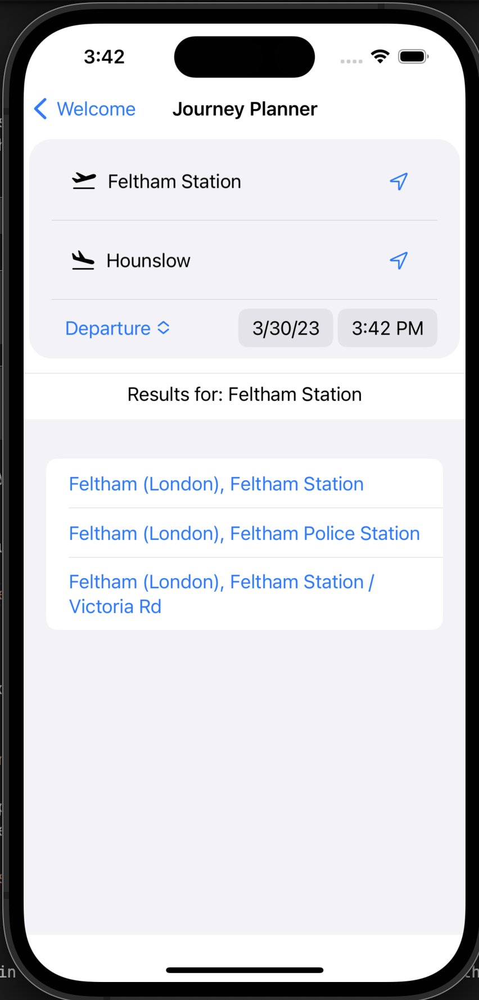

### Disruptions

While traveling it is always useful to check for any disruptions to your journey, especially now when there are a lot of strikes happening - you can do that using the Disruptions feature. It will give a complete list of any disruptions that are happening on any of the app supported transport modes:

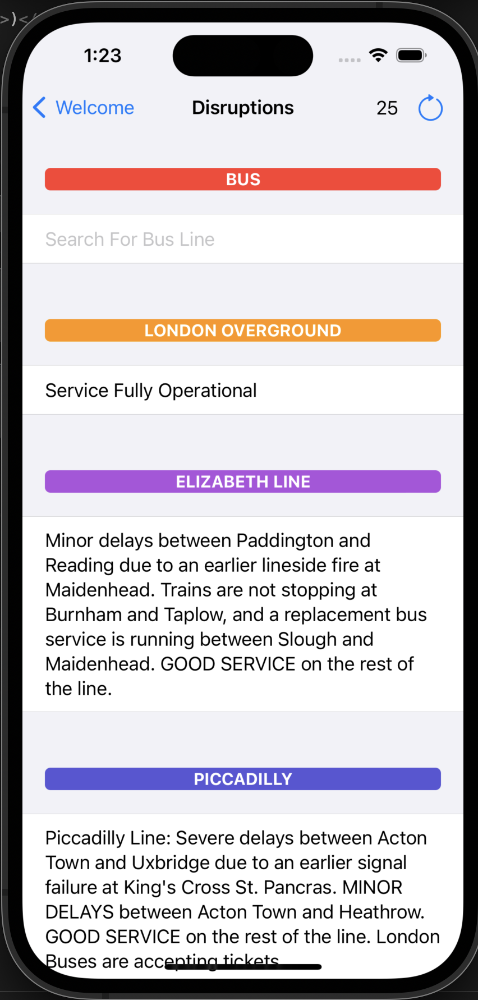

As you can see above you get a full list of any disruptions for rail based transport modes (you can scroll down to see remaining tube lines) and you can also search for individual buses to see if they are affected, for example as you can see above the bus that I take to school (285) is unaffected:

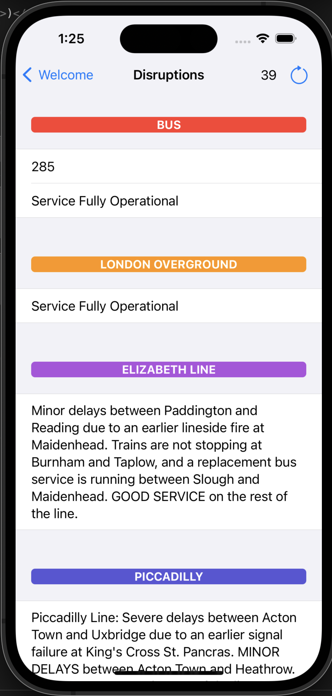

### Stop Searching

There are three ways to find stops and this is the main one - searching for it by name. You can enter the name of the stop in the text field at the top of the view and submit to search for groups of stops:

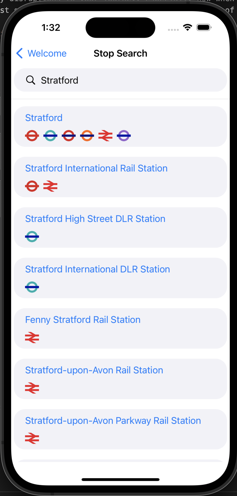

As you can see above you are presented with a groups of stops that match the name that you have provided, you are also presented with icons of modes of transportation that are present on this stop. You can niw click on any of the stop groups to see individual stops that are within that group:

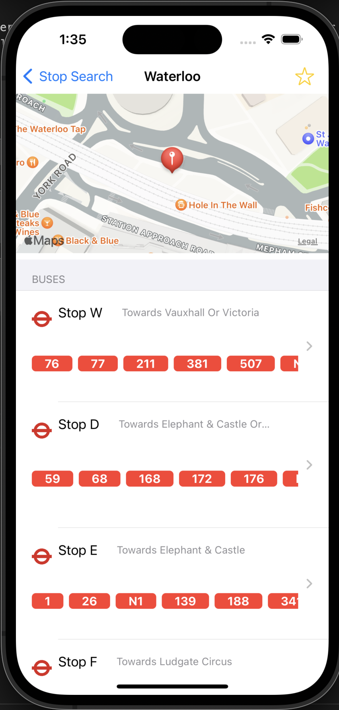
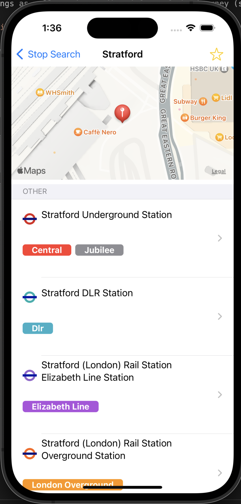

Here you can see each individual stop with the direction (for buses, not all stops have them too) and the lines that it has (for example: bus 285, picaddily line etc). You can now click on any of the stops to see arrivals for it. This feature is presented in [Arrivals](#arrivals)

Also note that you can add a stop group to favourites here, this can be done by clicking the star icon in the upper right corner, if the star is filled it means that the stop is already in favourites. You can read more about it [Here](#favourite-stops)

### Nearby Stops

Another way in which you can find stops is the "Nearby Stops" feature, it uses the device location to find stop groups within a specific radius of the user (it can be configured in settings):

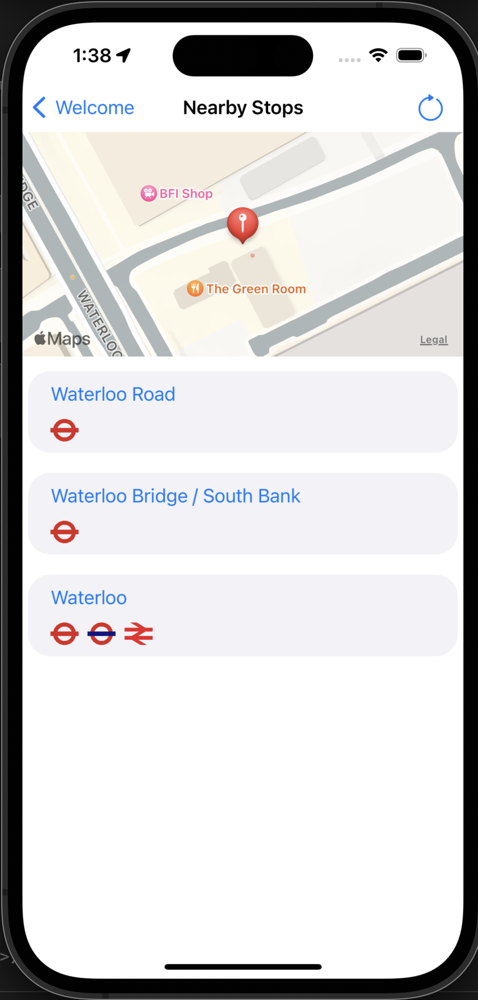

As you can see I am getting a list of stops nearby my location, this was done in an iOS simulator with a location set to Waterloo. Just like when searching by name you can click on a stop group to get a list of individual stops and their arrivals or add them to favourites. Note that you can also click the refresh button in the upper right corner to refresh the results when your location changes.

### Favourite Stops

After adding a stop to favourites it will be found here for quick access. You can change how the favourites stop groups here are sorted by going to the settings.

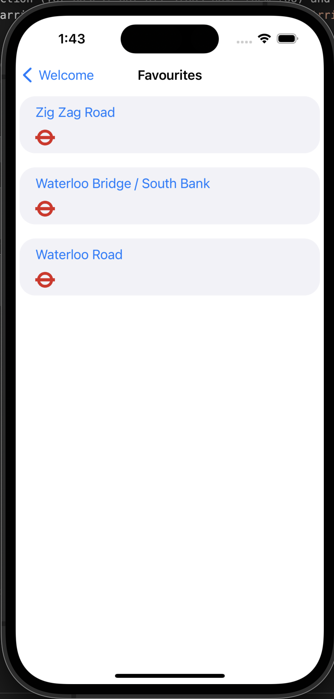

### Arrivals

When clicking on an individual stop within a stop group you can see when the next bus or other form of transportation will arrive:

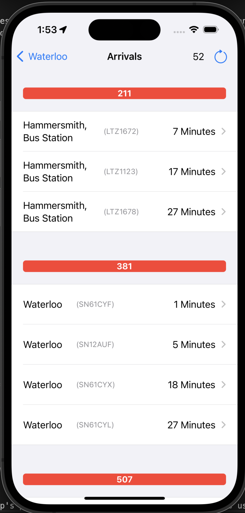
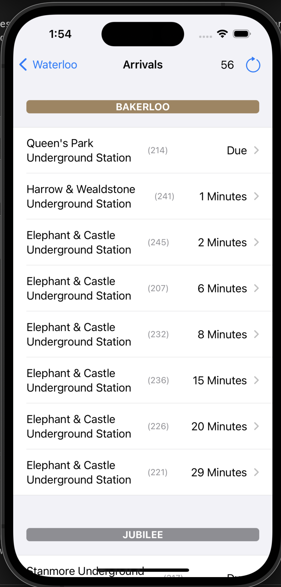

You get a detailed view of when exactly the vehicle will arrive (you can change the format of that in the [Settings](#settings)) as well as the vehicle ID and the direction in which the bus is going (it's last stop). Should you want to refresh the arrivals you can do so by clicking the button in the top right corner, there is also a timer in the top left corner that counts down to the automatic refresh of the arrivals. You can click on an individual arrival to see this vehicle's arrivals at it's designated stops:

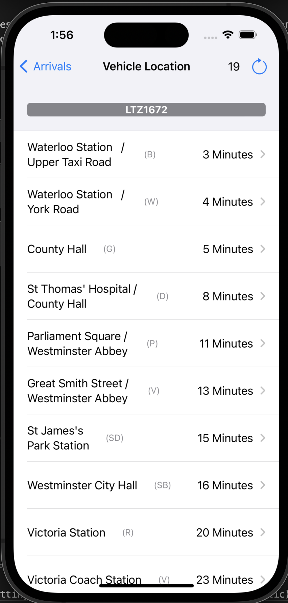

### Settings

The app contains a settings menu to change various behavior within it:

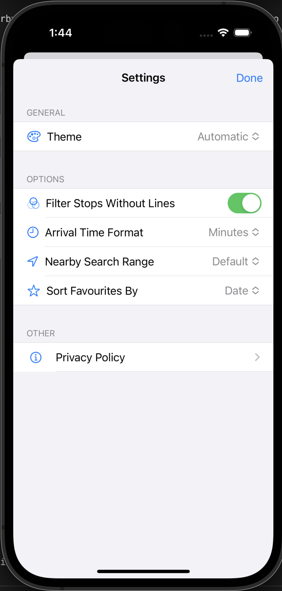

 - Theme: Allows the user to overwrite iOS theme setting for the app (or not if it's set to automatic)
 - Filter Stops Without a Line: There are many bus stops that do not serve the publc such as aligning points, these can be filtered out using this setting, it is turned on by default
 - Arrival Time Format: Allows the user to change individual arrivals are presented: number of minutes, number of seconds or a simple clock.
 - Nearby Search Range: This setting affects the range of scanning for nearby stops using [Nearby Stops](#nearby-stops) feature.
 - Sort Favourites By: Allows the user to decide how stop groups in [Favourites](#favourite-stops) are ordered.

Privacy Policy takes the user to the text of the app's privacy policy that explains how the data is used.

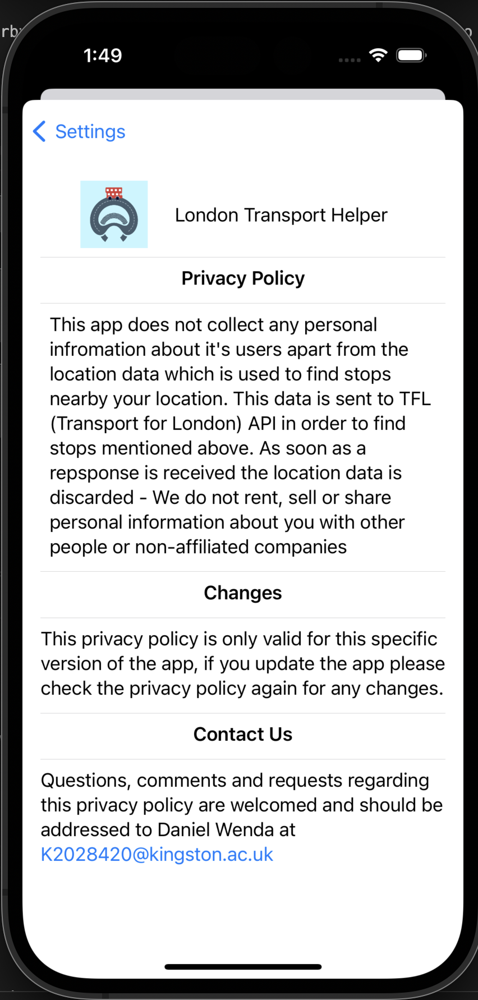

### Other

There are other features in the "Other" section of the home screen, these mostly include links to useful websites such as:

- National Rail Timetables (As they were removed from TFL's API)
- TFL Staff Feedback Form
- Tube Map

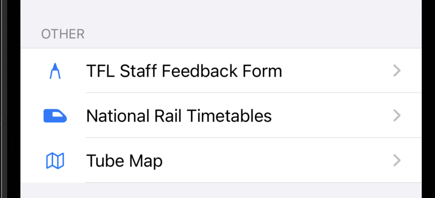

(<a href="#top">back to the top</a>)

## Roadmap

- Initial Version:
  - [x] Stop Searching by Name
  - [x] Nearby Stop Searching
  - [x] Arrivals
    - [x] Buses
- Version 1:
  - [x] Favourites & Persistent Storage
  - [x] Arrivals
    - [x] Rail Based (Overground, Tube, Elizabeth Line) 
- Version 2:
  - [x] User settings
- Version 3:
  - [x] Simple Journey Planner
- Final Version:
  - [x] Fully Featured Journey Planner
  - [x] All Other Features Completed

(<a href="#top">back to the top</a>)

## Building and Starting The Application

If you have no experience building iOS applications here is a step by step guide on how to build and start it:

- Upon starting Xcode click on "File" in the macOS menu bar then "Open" and navigate to the folder where the repository has been cloned to, this should open the code editor and main Xcode window.

- In 'utilties/APIManager.swift' enter your TFL API Key.

- You should now see, in the left upper corner the following button:

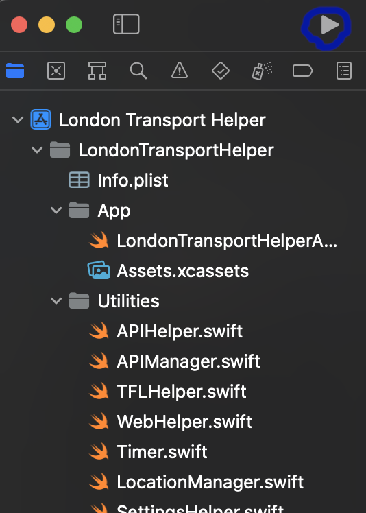

- When you click the button the iOS simulator should launch with the app.

- If you want to use your own phone for the testing you can do so by connecting it to your mac and clicking on the button as shown on picture below and choosing your own device.

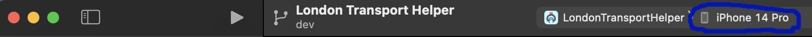

- You can also choose a macOS version and/or iPadOS version from there too, the app works well on both.

(<a href="#top">back to the top</a>)

## License

This project was completed for my Mobile App Development module for Kingston University. Anyone who has access to it is free to view, edit
or share it with anyone else as long as the original work and author is attributed.

(<a href="#top">back to the top</a>)

